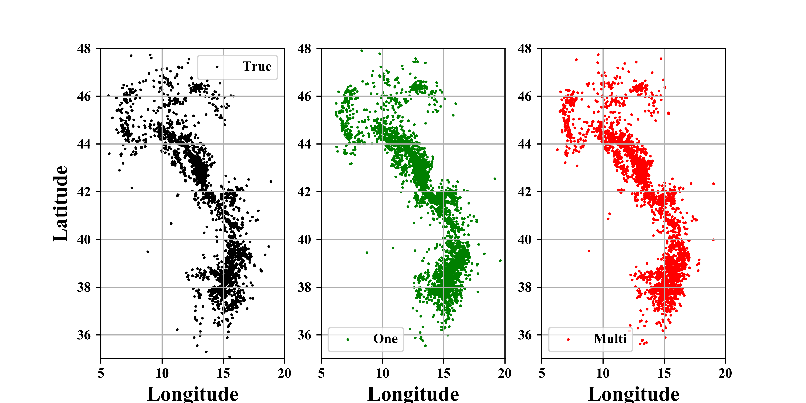

DISAZI is a pipline to achieve single-station location.
DISAZI consists of DisNet and AziNet.
Author: Ji Zhang  
Date: 2024.03.08  
Version 1.0.0 

## Install
This is the latest version on python 3.8, before on python 3.6.
>      python==3.8.8
>      tensorflow-gpu==2.7.0
>      keras==2.7.0

## DATA
> you need change the file path   
--data_dir: STEAD.h5 dataset  
--cvr_dir: STEAD.csv file

! you can load <code>[STEAD Data](https://github.com/smousavi05/STEAD)</code> or use `https://github.com/smousavi05/STEAD` to get dataset.

## Fast run!!!

> train DisNet
---   
    python DISAZI_DIS_MAIN.py --mode=pre_train --epochs=100 --patience=5 --model_name=DisNet_model

> predict DisNet
--- 
    python DISAZI_DIS_MAIN.py --mode=predict --model_name=DisNet_model

> train AziNet
---
    python DISAZI_AZI_MAIN.py --mode=pre_train --model_name=AziNet_model --epochs=100 --patience=5

> predict AziNet
--- 
   	python DISAZI_AZI_MAIN.py --mode=predict --model_name=AziNet_model 

## INSTANCE
The well trained models are applied to Italy area.

### Envirment 
>      
>      python==3.6.6
>      tensorflow-gpu==1.10.0
>      keras==2.2.4
### data
> you need change the file path   
--data_dir: instance.h5 dataset  
--cvr_dir: instance.csv file

you can load <code>[INSTANCE Data](https://github.com/ingv/instance)</code> or use `https://github.com/ingv/instance` to get dataset.

### transfer learning
> train disnet
> --- 
	nohup python DISAZI_DIS_MASTER_INSTANCE.py --mode=train --epochs=100 --patience=5 --model_name=IN_DisNet_model02 --GPU=4 > INDIS02.txt 2>&1 &

> train azinet
> --- 
	nohup python DISAZI_AZI_MASTER_INSTANCE.py --mode=train --epochs=100 --patience=5 --model_name=IN_AziNet_model02 --GPU=1 > INAZI02.txt 2>&1 &

### Application
Use the well trained modell to INSTANCE dataset.

Achieve single-station location and  Multi-station location

Please run the code `INSTANCE_TEST_MASTER.py`

